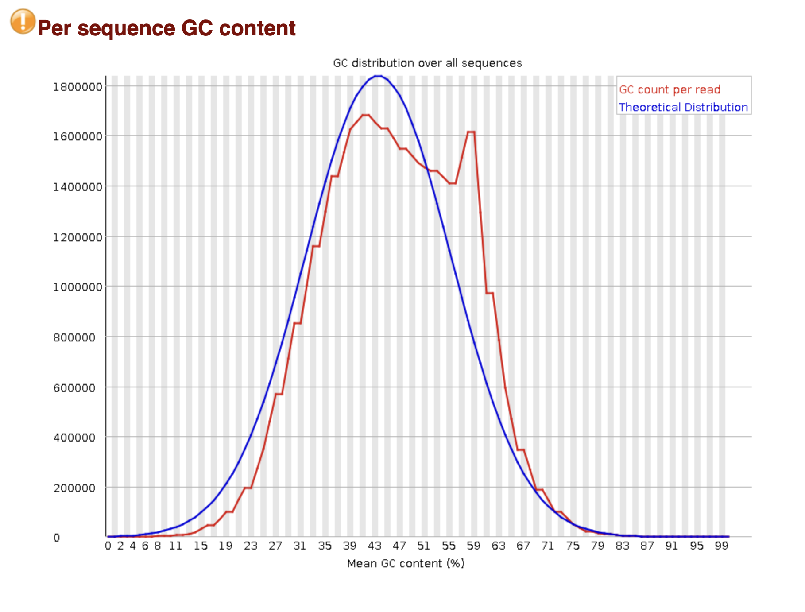

### Ссылка на колаб (

https://colab.research.google.com/drive/1j4kdiUgMderHt5i1b0qUGLR9-2J60fvd?usp=sharing

### Выдача FastQC

| Файлы                   | Их обрезанные версии            | 
|-------------------------|---------------------------------|
| ENCFF001FMA_fastqc.html | ENCFF001FMA_trimmed_fastqc.html | 
| ENCFF001FMC_fastqc.html | ENCFF001FMC_trimmed_fastqc.html | 
| ENCFF001HOD_fastqc.html | ENCFF001HOD_trimmed_fastqc.html | 

### Скриншоты важных элементов (для обрезанных версий)

| 1-ая ChipSeq реплика  | 2-ая ChipSeq реплика  | Контроль              |
|-----------------------|-----------------------|-----------------------|
|  |  |  |
|  |  |  |
|  |  |  |
|  |  |  |
|  |  |  |

### Таблица со статистикой по каждому из 3 образцов

|               | Сколько было ридов | Выровненные уникально | Выровненные неуникально | Не выровненные |
|---------------|--------------------|-----------------------|-------------------------|----------------|
| `ENCFF001FMA` | 18710074           | 896565                | 3033192                 | 14780317       |
| `ENCFF001FMC` | 19510504           | 941137                | 3062445                 | 15506922       |
| `ENCFF001HOD` | 18276725           | 941400                | 2584557                 | 14750768       |

### Диаграммы Венна

Здесь должны были быть диаграммы, я написал код для их получения, однако получил внутреннию ошибку `intervene`: `cannot import name 'Iterable' from 'collections'`.

| 1 реплика с ENCODE                | ENCODE с 1 репликой               |
|-----------------------------------|-----------------------------------|
|  |  |

| 2 реплика с ENCODE                | ENCODE и 2 репликой               |                                                                                         
|-----------------------------------|-----------------------------------|
|  |  |

### Ответы на вопросы

Проанализируйте выдачу bowtie. Почему процент выравниваний получился именно таким?

Ответ: Процент выравниваний довольно низок, так как мы варавнивали всего на одну хромосому из 46.
